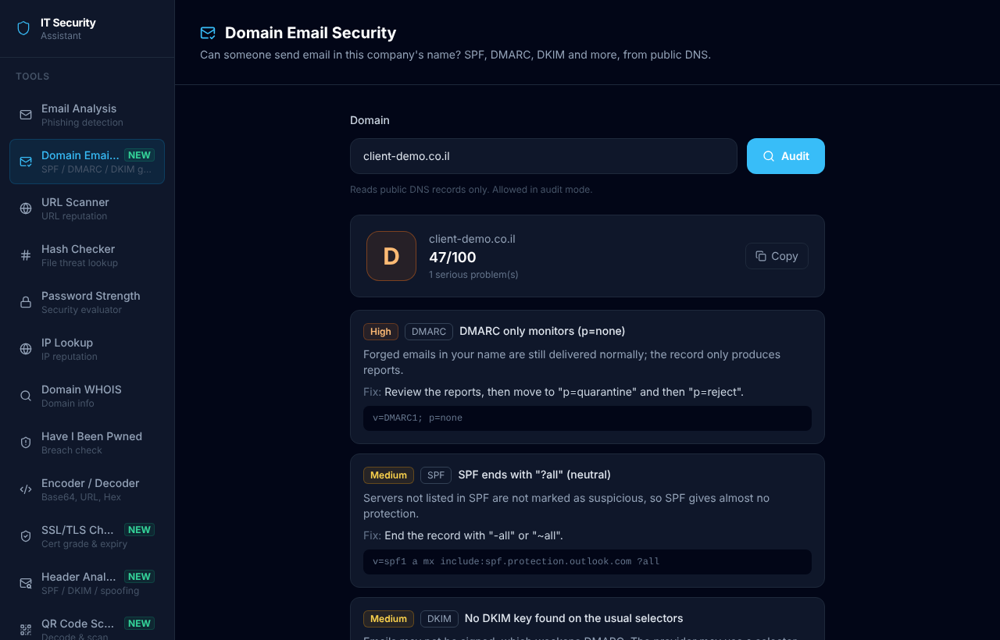

# IT Security Assistant

[](https://github.com/shimon3/it-security-assistant-v2/actions/workflows/ci.yml)

A security toolbox for auditing small businesses: can someone send email in the company's name, are staff passwords in known breaches, is this email phishing?

**Live:** https://it-security-assistant-v2.vercel.app (online lookups need a private access token)



## Tools

| Tool | What it does | Runs where |
| --- | --- | --- |
| Domain Email Security | Grades a domain A–E from its public DNS: SPF (incl. the 10-lookup limit), DMARC, DKIM, DNSSEC, MTA-STS, TLS-RPT. Each finding has a plain-language impact and a fix. | Edge function, DNS-over-HTTPS |
| Email Analysis | Phishing score for a pasted email: urgency wording, look-alike domains, Israeli bank impersonation, premium-rate numbers, risky attachments. | Browser |
| Header Analyzer | SPF/DKIM/DMARC results, Reply-To and Message-ID mismatches in raw headers. | Browser |
| Have I Been Pwned | Checks a password against breach data with k-anonymity: only 5 hex characters of its SHA-1 leave the browser. | Browser |
| Password Strength | Entropy, common-password list, time to crack. | Browser |
| QR Code Scanner, Encoder/Decoder | Decode QR codes from an image or camera; Base64, URL, hex. | Browser |
| URL / Hash / IP / Domain reputation, SSL check | VirusTotal and SSL Labs lookups. **Personal use only** (see audit mode). | Edge functions |

## Audit mode

A switch in the sidebar for paid client work:

- hides tools backed by APIs whose terms forbid commercial use (VirusTotal public API, Qualys SSL Labs);
- does not keep analysed emails in browser history;
- anonymises exported reports (email addresses masked, URL paths removed).

The **Data & Privacy** page lists what each tool sends where, and what is kept.

## Security design

- API keys live only in Vercel environment variables; the front end never sees them.
- Every `/api` route requires a bearer token (`ACCESS_TOKEN`) and is rate-limited to 10 requests per minute per IP and route, before the token is checked, so token guessing is throttled too.
- Strict Content-Security-Policy, `X-Frame-Options: DENY`, `nosniff`, camera allowed for the QR scanner only.
- Inputs are validated server side (domain, IP, hash, URL formats and lengths).
- Errors return real HTTP status codes (401, 429, 502…).

## Stack

React 18, TypeScript, Vite, Tailwind CSS · Vercel Edge Functions · Vitest · GitHub Actions.

## Run locally

```bash
npm ci
cp .env.example .env.local   # then fill in the values
npm run dev                  # front end only
npx vercel dev               # front end + /api routes
```

| Variable | Required | Purpose |
| --- | --- | --- |
| `ACCESS_TOKEN` | yes | Token for the `/api` routes, at least 16 characters (`openssl rand -hex 24`). |
| `VIRUSTOTAL_API_KEY` | for VirusTotal tools | Free public API key, personal use. |
| `UPSTASH_REDIS_REST_URL`, `UPSTASH_REDIS_REST_TOKEN` | recommended in production | Shares rate-limit counters across Edge instances. |

## Checks

```bash
npm run lint && npm run typecheck && npm test && npm run build
```

CI runs the same checks plus `npm audit` on production dependencies at every push.
